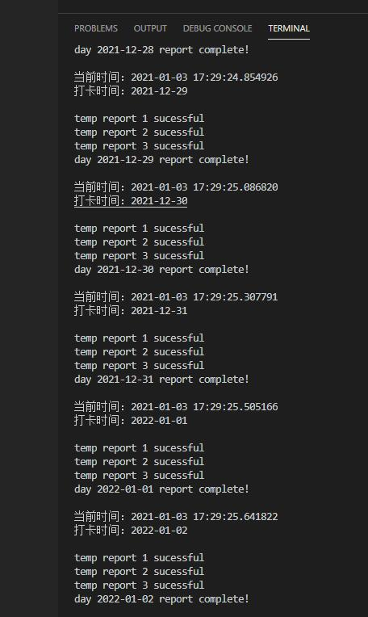

# 电子科技大学研究生健康状况自动填报

## 免责说明

注意！！！！！仅做学习使用，禁止用来瞒报打卡，违者后果自负

## selenium以及geckodriver

需要selenium模块来模拟浏览器操作，需要下载firefox浏览器的[geckodriver](https://github.com/mozilla/geckodriver/releases)。

## 配置

配置python环境：`pip install -r requirements.txt`

在`self.driver = webdriver.Firefox(executable_path=r"D:/geckodriver.exe", options=options)`将地址更换为你的geckodriver所在位置。

根据personal_info_demo.py添加自己的信息，并更名为personal_info.py

## 运行

### 每日打卡

```bash
python main.py
```


### 一劳永逸

```bash
python once_for_all.py
```


## 实现思路
通过chrome的develop tools的network面板在每日打卡填报时候进行抓包，找到进行每日报平安以及体温上报的api。
+ 首先在postman中测试直接请求api是否可行，发现只需要带个人cookie以及报平安以及体温的参数即可。
 
+ 其次还偶然发现并不需要与个人cookie进行绑定才能进行打卡，换言之，只要登录上了，如果有别人的学号和姓名就可通过脚本帮他体温打卡，报平安填的个人参数会更多些也更私人。
    > 只要登录上了就可向体温上报和报平安的数据库中写数据，而这个数据只要符合格式就可，是谁的都可以
    >（以上为个人猜测的后端实现）

+ 对于体温上报的api，每日可以多次体温上报，并不只早中晚各一次，而是无限次，只是在前端做了限制。
    > 前端的逻辑是当点击了体温上报按钮后先调用查询体温上报的api，看当前时段是否打卡过，如果打过则弹窗已经打过结束；
    > 如果没打过，则调用体温打卡的api，打卡当前次，之后再调用一次查询全部体温打卡记录的api刷新整个页面。
  
+ 对于每日报平安的api，也是可以多次报平安，但页面上只显示最近的一次。故猜测后端有两种可能的实现方式，一是当天重复打卡的会覆盖掉上一次的，二是也是打卡无限次，但前端做了处理，只显示当天最近的一次打卡。

- [x] 每日三次体温上报的逻辑，同前端处理一样，为了不重复打卡，先检测是否打卡过
- [x] 每日报平安,直接调用报平安的api
- [x] cookie失效检测，目前是用selenium来自动获取的cookie，如果觉得配置selenium比较麻烦，可以对代码做如下处理
```python
# 注释掉main.py下__init__函数下初始化selenium driver部分
option = webdriver.ChromeOptions()
option.add_argument(r"user-data-dir=C:/Users/onion_rain\AppData/Local/Google/Chrome/User Data")
self.driver = webdriver.Chrome(r"D:/chromedriver.exe", options=option)
#注释掉__main__下调用login函数部分
reportor.login()
```
前往[uestc每日打卡界面](http://eportal.uestc.edu.cn/jkdkapp/sys/lwReportEpidemicStu/index.do),如果没有登录则先登录，登录进入后，打开浏览器开发者界面的network面板，复制如下的cookie到main.py里


## 待实现
经过测试cookie失效时间比较短，不可能挂着脚本几个月每天都自动打卡，如果失效了则需要重新登录获取cookie，此部分需要通过代码完成
- [ ] 通过纯python的request库来进行登录
    >登录时候密码进行了加密同时还有一堆加密的参数
- [ ] 滑块验证码的破解
